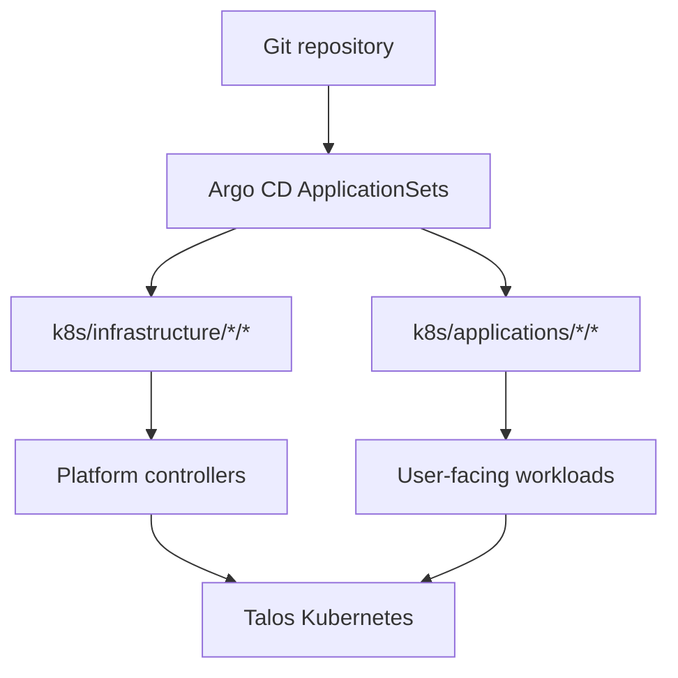

<div align="center">

# Eudald's Homelab

_GitOps-managed home infrastructure powered by Talos, Kubernetes, OpenTofu, Argo CD, and Cilium._

<p>
  <a href="https://badges.eudald.gr"></a>
  <a href="https://badges.eudald.gr"></a>
  <a href="https://badges.eudald.gr"></a>
  <a href="https://badges.eudald.gr"></a>
  <a href="https://badges.eudald.gr"></a>
</p>

</div>

---

## Overview

This repository is the source of truth for my homelab: virtual machines, Talos
bootstrap, Kubernetes platform controllers, applications, secrets, backups, DNS,
and selected services that still run outside the cluster.

The operating model is deliberately boring:

1. OpenTofu creates and bootstraps the infrastructure.
1. Talos runs Kubernetes on Proxmox VMs.
1. Argo CD reconciles the desired state from `k8s/`.
1. Controllers handle networking, storage, certificates, databases, policy, and backups.

---

## Kubernetes

The active cluster is a six-node Talos Kubernetes deployment on Proxmox VE.

| Role | Nodes |
| --- | --- |
| Control plane | `ctrl-01`, `ctrl-02`, `ctrl-03` |
| Workers | `work-01`, `work-02`, `work-03` |

The Kubernetes API is exposed at `https://10.1.20.50:6443`. Local read-only
inspection uses the generated kubeconfig:

```bash
export KUBECONFIG=./tofu/home.arpa/fgs/pve/output/kubeconfig
kubectl get nodes -o wide
kubectl get applications.argoproj.io -n argocd -o wide
```

The `Targets` badge counts Prometheus scrape targets that are currently up. It
is a monitoring signal, not a count of pods or public services.

### Core Components

| Area | Components |
| --- | --- |
| GitOps | Argo CD, ApplicationSet, Kustomize, Helm charts rendered by Kustomize |
| Networking | Cilium, Gateway API, LB IPAM, BGP, L2 announcement, ExternalDNS with AdGuard webhook |
| Ingress and tunnels | HTTPRoute, TLS passthrough, Pocket ID, Newt/Pangolin |
| Secrets | Bitnami Sealed Secrets, SOPS for local encrypted files |
| Storage | Proxmox CSI on Ceph SSD and local ZFS, NFS for selected shared data |
| Databases | CloudNativePG with barman-cloud ObjectStore backups |
| Backups | Velero with Kopia, RustFS local target, Backblaze B2 offsite target |
| Observability and policy | kube-prometheus-stack, Hubble, Falco, Gatekeeper, Kyverno |

---

## GitOps

Argo CD watches this repository through two ApplicationSets:

- `k8s/applications/application-set.yaml` discovers `k8s/applications/*/*`
- `k8s/infrastructure/application-set.yaml` discovers `k8s/infrastructure/*/*`

Each deployable application or platform component owns its own
`kustomization.yaml`. There is no root kustomization that builds every app at
once; validation is done at the changed leaf.

```bash
kustomize build --enable-helm k8s/infrastructure/controllers/argocd
kustomize build --enable-helm k8s/applications/tools/it-tools
```



---

## Infrastructure

The Proxmox Kubernetes path is split into three OpenTofu stages.

| Stage | Path | Responsibility |
| --- | --- | --- |
| Cluster | `tofu/home.arpa/fgs/pve/stack.cluster/` | Proxmox resources, VM definitions, DNS, storage, ACLs |
| Talos | `tofu/home.arpa/fgs/pve/stack.talos/` | Talos machine config, Kubernetes bootstrap, Cilium bootstrap, kubeconfig output |
| Kubernetes | `tofu/home.arpa/fgs/pve/stack.k8s/` | cert-manager, Sealed Secrets, Argo CD, and GitOps bootstrap |

Additional infrastructure lives in:

- `tofu/backblaze/homelab/` for backup buckets.
- `tofu/hetzner/homelab/` for Hetzner resources.
- `ansible/` for host preparation.
- `compose/ds920plus/prod/` for Compose workloads managed around Komodo and Pangolin.

---

## Repository

```text
.
├── ansible/      # Host preparation for container hosts, Komodo, and Pangolin
├── compose/      # Compose stacks for ds920plus, split into prod and archive
├── coreboot/     # Coreboot firmware work
├── k8s/          # Kubernetes desired state reconciled by Argo CD
├── komodo/       # Komodo resources: servers, repos, syncs, actions, builders
├── packer/       # Packer templates and variables
├── scripts/      # Local operator helpers
├── secrets/      # Sensitive material
└── tofu/         # OpenTofu stacks and modules
```

---

## Operations

Useful read-only checks:

```bash
export KUBECONFIG=./tofu/home.arpa/fgs/pve/output/kubeconfig

kubectl get applications.argoproj.io -n argocd -o wide
kubectl get gateway,httproute -A -o wide
kubectl get storageclass,pvc -A
kubectl get clusters.postgresql.cnpg.io -A -o wide
kubectl get schedules.velero.io -n velero -o wide
```

OpenTofu validation is run per stack:

```bash
tofu -chdir=tofu/home.arpa/fgs/pve/stack.cluster validate
tofu -chdir=tofu/home.arpa/fgs/pve/stack.talos validate
tofu -chdir=tofu/home.arpa/fgs/pve/stack.k8s validate
```

For agent and operator guardrails, read [AGENTS.md](./AGENTS.md).

---

## Safety

This repository controls real infrastructure.

- Prefer GitOps over manual cluster mutation.
- Treat `./deploy` as unsafe notes, not as a normal deployment command.
- Do not commit plaintext secrets, kubeconfigs, private keys, tfstate, or local environment files.
- Do not modify SOPS-encrypted files or sealed secret source material unless that is the explicit task.

---

## Inspiration

The layout is inspired by the home-operations community, especially repositories
that keep infrastructure understandable by making the current state visible at a
glance. The implementation here is tailored to this cluster's actual Proxmox,
Talos, Cilium, Proxmox CSI, Sealed Secrets, Velero, and Compose setup.
